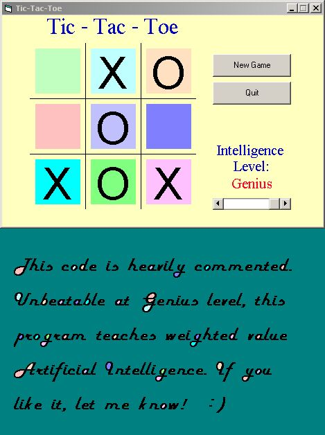



## \[   Perfect Tic Tac Toe     \]

### Description

Demonstrates the use of variable levels of AI to challenge an opponent at any level. Highest level is unbeatable, lowest level is very easy. This code is HEAVILY documented (see for yourself). Can you beat the "Clever" level???
 
### More Info
 

             |
---                |---
**Submitted On**   |2003-07-08 16:55:38
**By**             |[Brian Matthew Anderson](https://github.com/Planet-Source-Code/PSCIndex/blob/master/ByAuthor/brian-matthew-anderson.md)
**Level**          |Beginner
**User Rating**    |4.8 (253 globes from 53 users)
**Compatibility**  |VB 5\.0, VB 6\.0
**Category**       |[Games](https://github.com/Planet-Source-Code/PSCIndex/blob/master/ByCategory/games__1-38.md)
**World**          |[Visual Basic](https://github.com/Planet-Source-Code/PSCIndex/blob/master/ByWorld/visual-basic.md)
**Archive File**   |[\[\_\_\_Perfec161178782003\.zip](https://github.com/Planet-Source-Code/brian-matthew-anderson-perfect-tic-tac-toe__1-39654/archive/master.zip)

